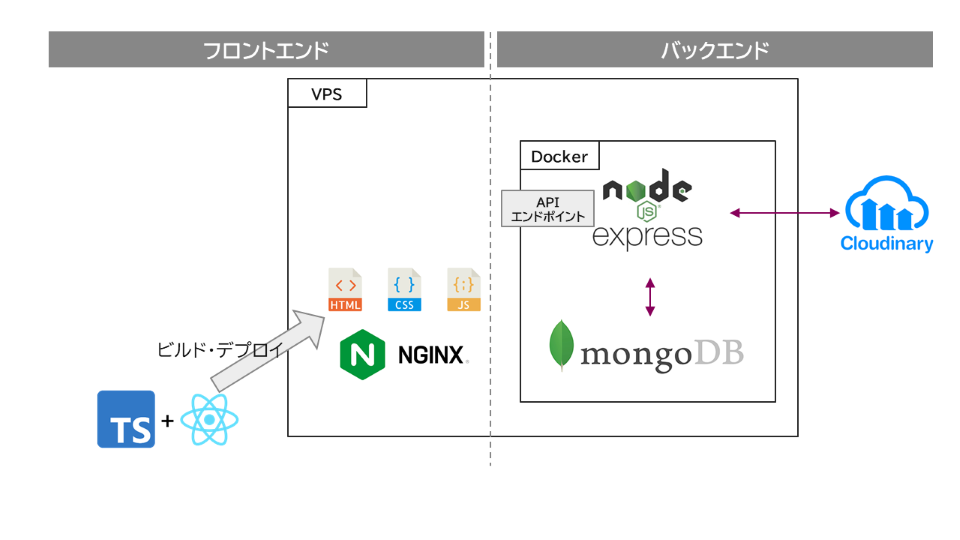

# Instamodoki

このアプリケーションは、フロントエンドのポートフォリオとして Instagram の基本機能を模倣して作成したものです。

# URL

Instamodoki を VPS 上にデプロイしており、以下のリンクからアクセス可能です。

- http://kk-portfolio.net/_LPwQRA3MjDmIxGlO/

写真の投稿やダイレクトメッセージ機能などを設けています。

# 機能一覧

- ユーザー登録、ログイン機能
- 写真投稿機能
- ユーザー検索機能
- Like 機能
- フォロー機能
- ダイレクトメッセージ機能
- 通知機能

---

# システム構成図

バックエンドも含めたシステム構成図を示します。  
本リポジトリは、下図の左下部分（Typescript + React）に相当します。  


---

# 使用技術

- Typescript
- React
- エコシステム
  - スタイリング： TailwindCSS をベースに、一部 MUI（旧 Material UI）を使用
  - 状態管理： zustand
  - API コール：　 React-Query
  - フォーム：　 React Hook Form

---

# ディレクトリ構成

```sh
src
├── assets            # 画像などの静的ファイル
├── components        # アプリケーション全体で使用できる共通コンポーネント
├── config            # 環境変数などをエクスポートするところ
├── features          # 機能ベースモジュール
├── hooks             # アプリケーション全体で使用できる共通hooks
├── lib               # ライブラリをアプリケーション用に設定して再度エクスポートしたもの
├── providers         # アプリケーションのすべてのプロバイダー
├── routes            # ルーティングの設定
├── stores            # グローバルステートストア
├── types             # アプリケーション全体で使用される基本的な型の定義
└── utils             # 共通のユーティリティ関数
```

---

# 工夫点

## コンポーネントのスコープに応じたディレクトリ構成

- ディレクトリ構成を横断的コンポーネントか限定的コンポーネントかによって分けています。

  - 横断的コンポーネント：
    - プロジェクト内で横断的に再利用される可能性が高い（関心範囲が広い、汎用性が高い）コンポーネント
  - 限定的コンポーネント：
    - プロジェクト内で横断的に再利用される可能性が低い（関心範囲が狭い、ある機能に特化した）コンポーネント

- 横断的な（アプリケーション全体に関わる）コードは src 直下の "components, hooks, providers, routes, types" に配置しています。
- 一方で 限定的コンポーネントは、"features" ディレクトリ内に機能単位でサブディレクトリを切り、その中に 必要に応じて "api, components, hooks, providers, routes, types" を作成しています。

  - 例) featureA 機能で API コールがあるなら "src/feature/featureA/api"ディレクトリを作成

- あるファイルを src 直下に置くべきか、それとも features 以下に置くべきかは、その機能が廃止されたときに共に消えていいかどうか、で判断します。

- この運用には次のメリットがあると考えています。
  - 関連するコンポーネント同士が近くに配置されている。（コロケーション）
  - 機能ごと削除するケースが発生した場合に その機能に特化したディレクトリを削除すれば事足りる。
  - アトミックデザインではないため、そのコンポーネントがどのレイヤーに属するか（特に Molecule or Organism）で悩むことがない。

## 外部ライブラリのコンポーネントをラップしたコンポーネントを内製

- 外部ライブラリのコンポーネントは、それを内製コンポーネントでラップし、各コンポーネントからは内製コンポーネントをインポートするようにしています。
- これによって、将来的に外部ライブラリのコンポーネントに破壊的な変更が入ったときに影響範囲を抑えられる可能性が高まります。
  - ラップしている内製コンポーネントのみの改修によって、外部ライブラリの変更を吸収できる可能性があるためです。

## ルーティング単位でのモジュールの遅延ロード

- モジュールバンドラーはいろいろな JS ファイルをまとめてくれますが、ユーザーが Web ページを開いた際に、すべてのページの JS ファイルが読み込まれる必要はありません。
- ユーザーが Web ページを開いたときには、その開いたページで必要な JS ファイルが読み込まれればよく、他の JS ファイルは、ユーザーがそれを必要とするページに遷移したときに読み込まれれば良いと考えます。
- "src/routes/\*.tsx"の lazyImport 関数（React.lazy をラップ）によってそれを実現しています。
